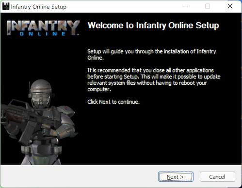
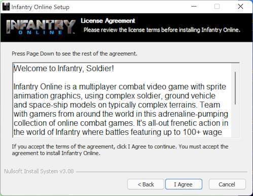
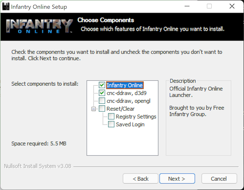
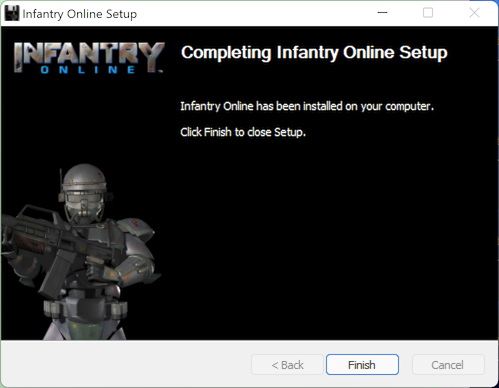
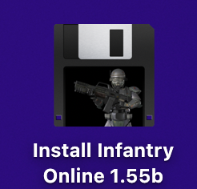
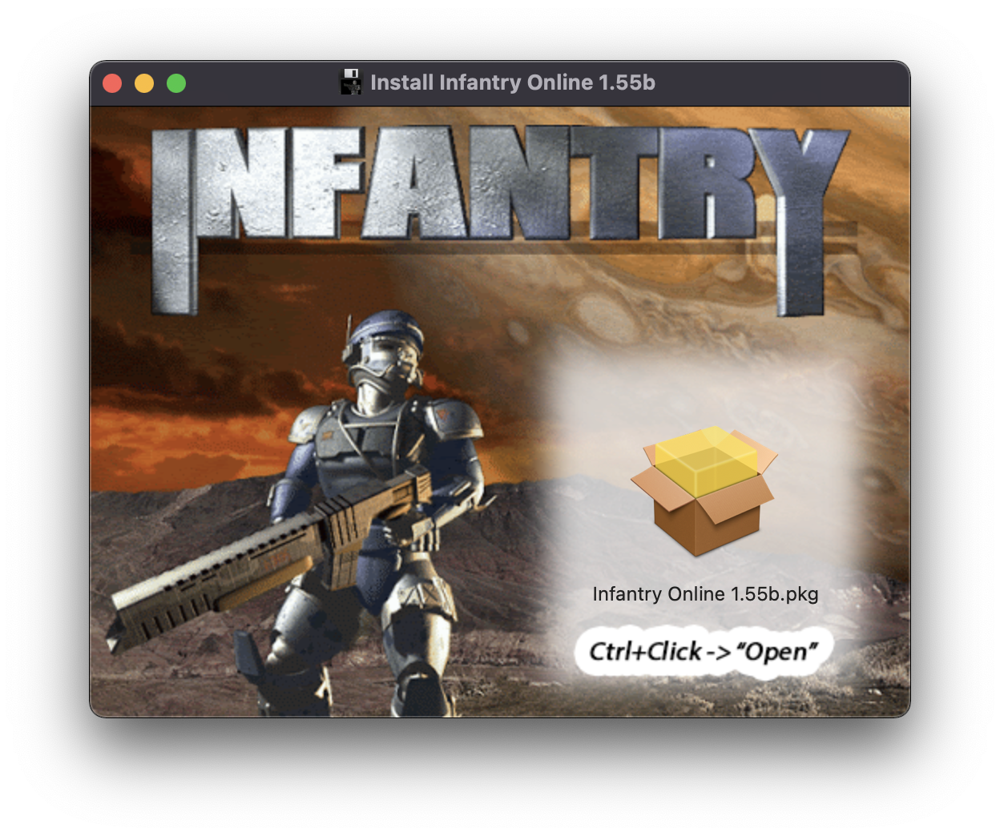
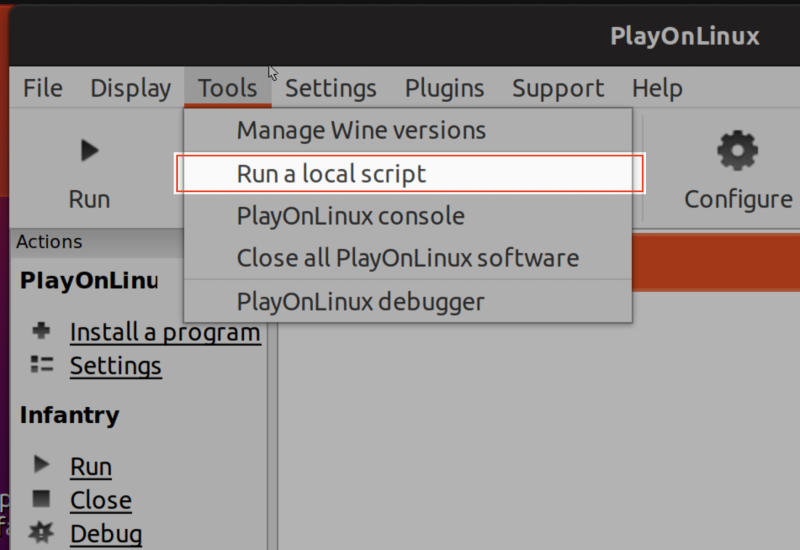
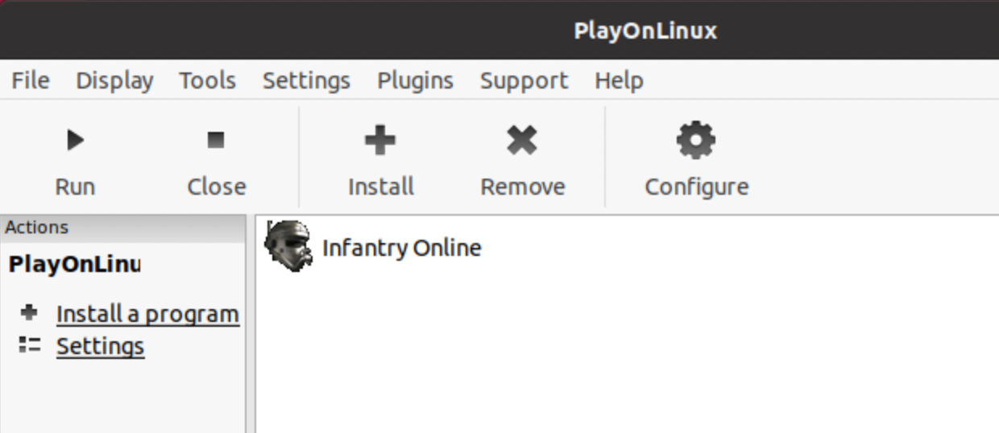
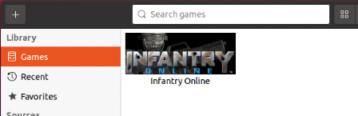

# FreeInfantry Client Setup/Installer Files

**Download the latest built, ready to play, FreeInfantry client at: [http://freeinfantry.com](http://freeinfantry.com)**

Navigate the sections below for instructions on how to compile or run the Installer source files for FreeInfantry on each platform.

## Windows Installer
**Windows XP or later (Yes, including Windows 11)**

  
Building the "NSIS" Script Installer

>
> **Prerequisites**
> 
> 1. *[Download & Install]* NSIS, Nullsoft Scriptable Install System ([https://nsis.sourceforge.io](https://nsis.sourceforge.io))
> 2. *[Download]* Built InfantryLauncher.exe & it's required files ([https://github.com/InfantryOnline/Infantry-Online-Server](https://github.com/InfantryOnline/Infantry-Online-Server))
> 3. *[Download]* cnc-ddraw ([https://github.com/CnCNet/cnc-ddraw](https://github.com/CnCNet/cnc-ddraw), Minimum version: 4.4.7.0)
> 
>
> **Step By Step**
>
> 1. Clone/Download this Github Repo
> 
> 2. Move the Infantry Launcher files (InfantryLauncher.exe, default.ini, Newtonsoft.Json.dll & imgs folder) inside here: `./Windows/_builds/launcher/`
>
> 3. Move the 4 cnc-ddraw files (ddraw.dll, ddraw.ini, cnc-ddraw config.exe & Shaders folder) inside here: `./Windows/_builds/cnc-ddraw/`
>
> 4. Open the NSIS Application
>
> 5. Click "Compile NSI Scripts"
>
> 6. Choose "File" -> "Load Script..."
> 
> 7. Navigate to the `./Windows/nsis-FreeInfantry-Lite.nsi` script and choose "Open"
>
> 8. It will automatically compile and (if no errors) will build the distributable installer .exe here: `./Windows/_builds/installer/`
>

  
Installing the Game (with Screenshots)

> 
>
>
>
>
>
>
>
>

## macOS Installer
**macOS 10.13 (High Sierra) or later**

  
(TODO) How to wrap the Windows .exe into a Mac .app with WineSkin

>
> **Prerequisites**
> 
> 1. *[Download & Install]* Wineskin Wrapper ([https://github.com/Gcenx/WineskinServer](https://github.com/Gcenx/WineskinServer))
> 2. *[Download]* cnc-ddraw ([https://github.com/CnCNet/cnc-ddraw](https://github.com/CnCNet/cnc-ddraw), Minimum version: 4.4.7.0)
> 
>
> **Step By Step**
>
> - TODO
>

  
Building the PKG Installer into a DMG

>
> **Prerequisites**
> 
> 1. *[Download & Install]* Mac "Packages" app ([http://s.sudre.free.fr/Software/Packages/about.html](http://s.sudre.free.fr/Software/Packages/about.html))
> 2. *[Download & Install]* Homebrew, The Missing Package Manager for macOS ([https://brew.sh](https://brew.sh))
> 3. `brew install create-dmg` ([https://github.com/create-dmg/create-dmg](https://github.com/create-dmg/create-dmg))
> 
> 
> **Step By Step**
>
> 1. Clone/Download this Github Repo
>
> 2. Place the built Wineskin wrapped FreeInfantry.app here: "./Mac/_builds/app/FreeInfantry.app"
>
> 3. Run the `./Mac/buildPackageDMG.sh` script in the terminal and it will build a .pkg installer file here: `./Mac/_builds/pkg/` and a distributable dmg file here: `./Mac/_builds/dmg/`
>

  
Installing the Game (with Screenshots)

>
> 1. Open the **DMG Volume Icon** on your desktop
> 
>    
>
> 2. Open the **.pkg** file by Control-Click and choosing "Open" in the contextual menu
> 
>   
>

## GNU/Linux Scripts and Instructions
**Any Distro that WINE supports**

  
Running the PlayOnLinux Script (with Screenshots)

  
>
> **Prerequisites**
> 
> 1. *[Download & Install]* PlayOnLinux ([https://www.playonlinux.com](https://www.playonlinux.com)), usually available with whatever linux default software distribution app you have. (ie: "Ubuntu Software" for Ubuntu, "Pamac Add/Remove Software" for Manjaro).
> 
> 
> **Step By Step**
>
> 1. Download the "./Linux/play-on-linux-freeinfantry.sh" Script from this repo (Make sure to grab the RAW file if downloading through the browser)
>
> 2. Open PlayOnLinux
>
> 3. Open the Tools menu and choose "Run a local script"
>
>
> 4. Follow the PlayOnLinux "Run Local Script" prompts.
>    - Browse to the downloaded "play-on-linux-freeinfantry.sh" script when it asks.
>    - Click "Next."
>    - Look the script code over make sure it's the one that came from this repo.
>    - Check "I Agree" to run this local script
>    - Click "Next" again to get into the PlayOnLinux installer.
>
> 5. Follow the installer prompts.  FreeInfantry installs to your PlayOnLinux game library and will be ready to play!
> 
>  
>

  
Running the Lutris Script (with Screenshots)

>
> **Prerequisites**
> 
> 1. *[Download & Install]* Lutris ([https://lutris.net](https://lutris.net))
> 
> 
> **Step By Step**
>
> 1. Download the "./Linux/lutris-freeinfantry.yaml" Script from this repo (Make sure to grab the RAW file if downloading through the browser)
>
> 2. Open the Terminal
>
> 3. Enter the command `lutris -i lutris-freeinfantry.yaml` and hit enter.  Lutris will open.
>
> 4. Click the "Install" button on the right.
> 
>   
>
> 5. Follow the installer prompts.  FreeInfantry installs to your Lutris game library and will be ready to play!
> 
>  
>

<!--

  
(TODO) Building SnapCraft Script

- TODO

-->

  
Generic Manual Installation (Rough Outline, more of a Guide)

>
> **Step By Step**
>
> 1. Download & Install WINE.  (5.0 or higher has been tested)
>     - [https://www.winehq.org](https://www.winehq.org)
> 
> 2. Use winetricks to install the .NET runtime (4.0 minimum required, 4.5.2 also works, have not tested higher)
>     - [https://wiki.winehq.org/Winetricks](https://wiki.winehq.org/Winetricks)
>     - ie: `sh winetricks dotnet40`
> 
> 3. Download the official FreeInfantry installer EXE and run it inside WINE
>     - [http://www.freeinfantry.com/download/win/latest/Install-FreeInfantry.exe](http://www.freeinfantry.com/download/win/latest/Install-FreeInfantry.exe)
>     - $ `wine path/to/downloads/Install-FreeInfantry.exe`
> 
> 4. Follow the installer prompts, defaults are good until you get to the "components" screen.  Be sure to choose the "cnc-ddraw, opengl" checkbox instead of the default "cnc-ddraw, dx9" checkbox.  (Both work for linux but you will get higher FPS with the opengl renderer.)
> 
> 5. After it's done installing, run the InfantryLauncher.exe with WINE
>     - $ `wine path/to/drive_c/Program Files/InfantryLauncher.exe`
> 
> 6. You are now ready to play!
> 

## Thanks to all Contributors

#### FreeInfantry
 - Spiff (Shameless shoutout to myself)
 - Realm (AKA Col. Kitty Hawk) for RnD/testing
 - Jovan for helping with source access & website
 - SocketMix for PlayOnLinux manual install guide and testing
 - The whole FreeInfantry team and players

#### CNC-DDraw
 - FunkyFr3sh for his work on cnc-ddraw to support this game for modern windows and WINE

#### Wine
 - Gcenx for his updates on WineSkin (originally created by doh123)
 - The Crossover team for making 32-bit windows apps work on 64-bit macOS

#### Many more people
