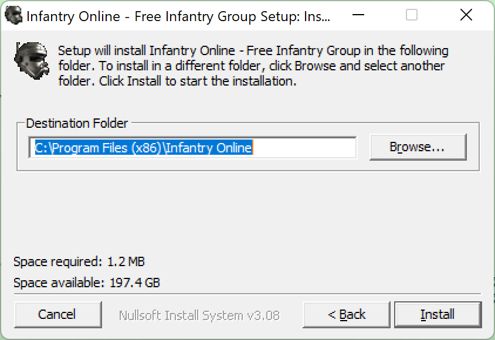

# Infantry Online Client Setup/Installer Files

**Download the latest built, ready to play, Infantry Online client at: [http://freeinfantry.com](http://freeinfantry.com)**

Setup/Installer source files for the Infantry Online game:

## Windows
**Windows XP or later**

  
Building the "NSIS" Script

>
> **Download/Install First**
> 
> - NSIS, Nullsoft Scriptable Install System ([https://nsis.sourceforge.io](https://nsis.sourceforge.io))
> 

1. Clone/Download this Github Repo

2. Obtain the official "Free Infantry Group" Launcher required files and place them in the folder here: "./Windows/_builds/launcher/"

3. Open NSIS

4. Click "Compile NSI Scripts"

5. Choose "File" -> "Load Script..."

6. Navigate to the "./Windows/nsis-Infantry-Online.nsi" script and choose "Open"

7. It will automatically compile and (if no errors) will build the installer .exe here: "./Windows/_builds/installer/Install-Infantry-Online.exe"

<!--

  
(TODO) Building the "Advanced Installer"

>
> **Download/Install First**
> 
> - Visual Studio 2019 Community Edition ([https://visualstudio.microsoft.com/vs/older-downloads/](https://visualstudio.microsoft.com/vs/older-downloads/))
> 

1. Get the official Infantry Online Launcher .exe file either from:

	- Compiling yourself from the Launcher repo or
	- Downloading the windows launcher exe

2. (TODO) More things...

-->

  
Installing the Game (with Screenshots)

TODO!

## macOS
**macOS 10.13 (High Sierra) or later**

  
(TODO) How to wrap the Windows .exe into a Mac .app with WineSkin

>
> **Download/Install First**
> 
> - WineSkin Wrapper ([https://github.com/Gcenx/WineskinServer](https://github.com/Gcenx/WineskinServer))
> - cnc-ddraw ([https://github.com/CnCNet/cnc-ddraw](https://github.com/CnCNet/cnc-ddraw))
> 

- TODO

  
Building the PKG Installer into a DMG

>
> **Download/Install First**
> 
> - Mac "Packages" app ([http://s.sudre.free.fr/Software/Packages/about.html](http://s.sudre.free.fr/Software/Packages/about.html))
> - `brew install create-dmg` ([https://github.com/create-dmg/create-dmg](https://github.com/create-dmg/create-dmg))
> 

 1. Place the built WineSkin wrapped client app here: "./Mac/_builds/app/Infantry Online.app"
 2. Run the "./Mac/buildPackageDMG.sh" in the terminal to build a .pkg installer file and a distributable dmg file.

  
Installing the Game (with Screenshots)

 - 1. Open the **DMG Volume Icon**

 - 2. Open the **.pkg** file by Control-Click and choosing "Open" in the contextual menu

## GNU/Linux
**Any Distro that WINE supports**

  
Running the PlayOnLinux Script (with Screenshots)

  
>
> **Download/Install First**
> 
> - PlayOnLinux ([https://www.playonlinux.com](https://www.playonlinux.com)), usually available with whatever linux default software distribution app you have. (ie: "Ubuntu Software" for Ubuntu, "Pamac Add/Remove Software" for Manjaro).
> 

1. Download the "./Linux/play-on-linux-infantry-online.sh" Script from this repo

2. Open PlayOnLinux

3. Open the Tools menu and choose "Run a local script"

 
 
4. Navigate to the downloaded "play-on-linux-infantry-online.sh" script.

5. Follow the prompts and Infantry will be installed and ready to play!

<!-- 

  
(TODO) Lutris Script

- TODO

  
(TODO) Building SnapCraft Script

- TODO

-->

  
(TODO) Manual Install with PlayOnLinux (with Screenshots)

- TODO

## Thanks to all Contributors

#### FreeInfantry
 - Spiff
 - Realm (AKA Col. Kitty Hawk) for RnD/testing
 - Jovan for helping with the repo & website
 - SocketMix for PlayOnLinux manual install guide and testing
 - The whole FreeInfantry team and players

#### CNC-DDraw
 - FunkyFr3sh for his work on cnc-ddraw to support this game for modern windows and WINE

#### Wine
 - Gcenx for his updates on WineSkin (originally created by doh123)
 - The Crossover team for making 32-bit windows apps work on 64-bit macOS

#### Many more people
